# Doodle Guess 사용자흐름도

## 1. 공통 진입 흐름

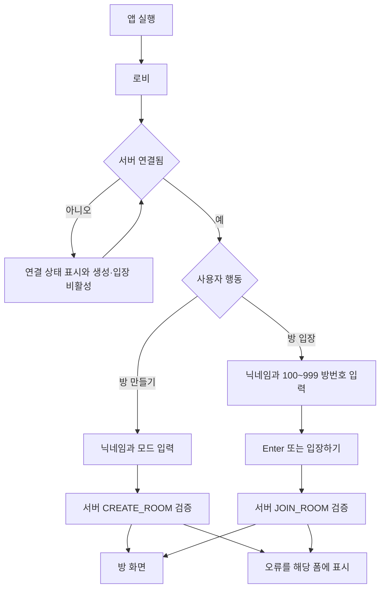

- 일반 모드 생성자는 호스트 겸 초기 drawer다.
- 진행자 모드 생성자는 호스트 겸 진행자 겸 초기 drawer다.
- 방 정원은 연결 끊김 복구 슬롯을 포함해 30명이다.
- 최근 접속 항목은 입력값만 채우며 자동 입장하지 않는다.

[근거: 게임 설명 1~3행·10~12행, 결정 D-02~D-04]

## 2. 일반 모드 호스트 흐름

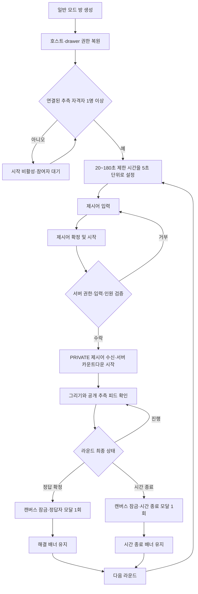

- 제시어 보기·가리기는 현재 탭의 로컬 상태다.
- 호스트는 자신이 제시어를 본 라운드에서 추측할 수 없다.
- `다음 라운드`에서 drawer 권한은 호스트에게 유지된다.

[근거: 게임 설명 4~7행, 결정 D-05~D-08·D-11]

## 3. 일반 추측자 흐름

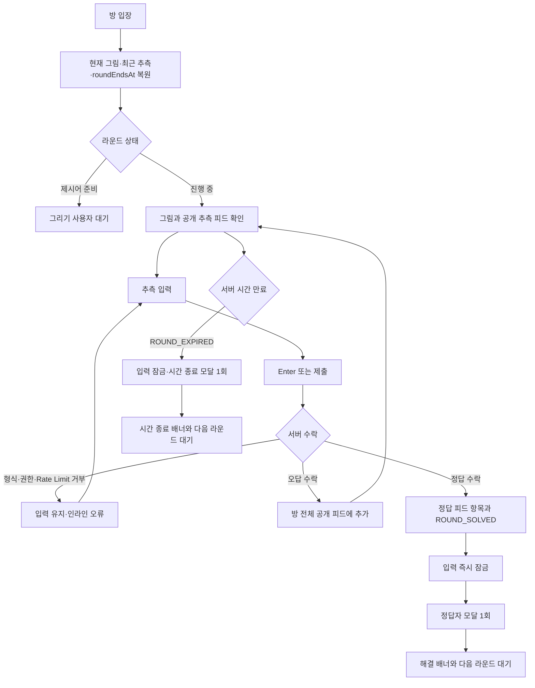

- 서버에 먼저 수락된 정답 한 건만 정답이 된다.
- 비교는 모든 Unicode 공백만 제거하고 나머지 문자는 그대로 둔다.
- 서버가 수락하지 않은 문자열은 공개 피드에 나타나지 않는다.

[근거: 게임 설명 4행·9행, 결정 D-08~D-10]

## 4. 진행자 모드 흐름

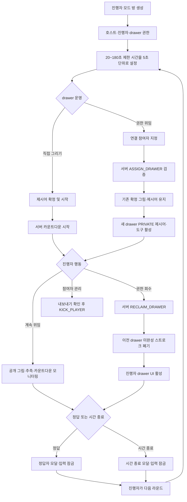

- 진행자는 항상 PRIVATE 제시어 수신 자격이 있지만 화면에서는 기본 가림이다.
- 현재·과거 drawer와 진행자는 해당 라운드의 추측 자격이 없다.
- 위임과 회수 후에도 서버에 확정된 그림과 제시어는 유지된다.

[근거: 게임 설명 8행·13행, 결정 D-04·D-07·D-08·D-11·D-12]

## 5. 위임받은 drawer 흐름

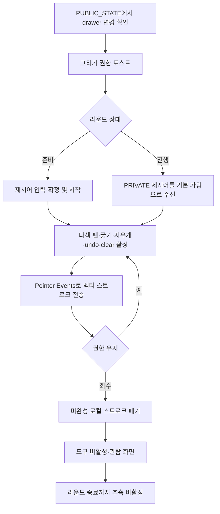

- 그리기 도구 상태는 로컬 UI 상태지만 색·굵기·tool 값은 서버 허용 목록에서만 고른다.
- `전체 지우기`는 확인 모달 뒤 서버가 수락했을 때만 캔버스를 비운다.

[근거: 게임 설명 6~8행, 결정 D-08·D-12·D-13]

## 6. 정답 경합과 모달 중복 방지 흐름

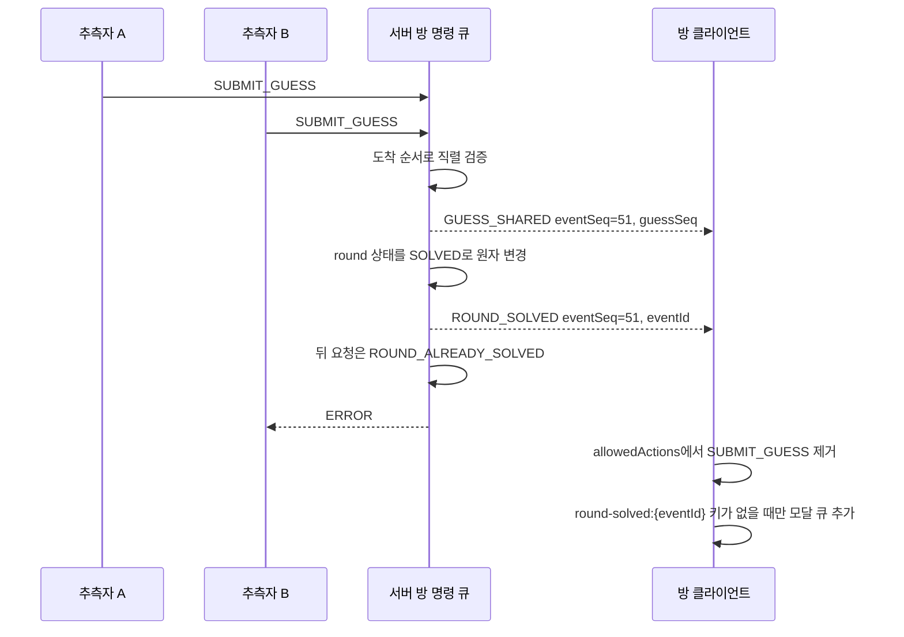

- 정답 추측 순서는 `guessSeq`, 논리 이벤트 순서는 `eventSeq`, 결과 모달 중복은 `eventId`로 확정된다.
- 재접속 스냅샷이 이미 해결된 라운드를 포함해도 동일 모달 키를 재생하지 않는다.

[근거: `PLANNING_PROMPT` 핵심 불변식 5~6, 결정 D-10]

## 7. 라운드 제한 시간 흐름

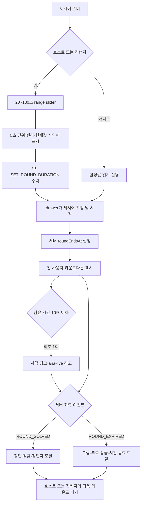

- 진행 중 slider는 disabled이며 변경 불가 사유를 표시한다.
- 새 방은 60초로 시작하고 다음 라운드는 마지막 서버 확정 설정값을 유지한다.
- 클라이언트 카운트다운은 표시용이며 0초 도달로 로컬 만료 이벤트를 만들지 않는다.
- 백그라운드 복귀와 재접속은 `/api/time` 왕복 측정으로 서버 시각을 다시 동기화하고 `roundEndsAt` 기준으로 즉시 복원한다. 이전 `roundId`의 지연 응답은 폐기한다.

[근거: 대표님 추가 결정 — 라운드 제한 시간]

## 8. 일반 참여자 재접속 흐름

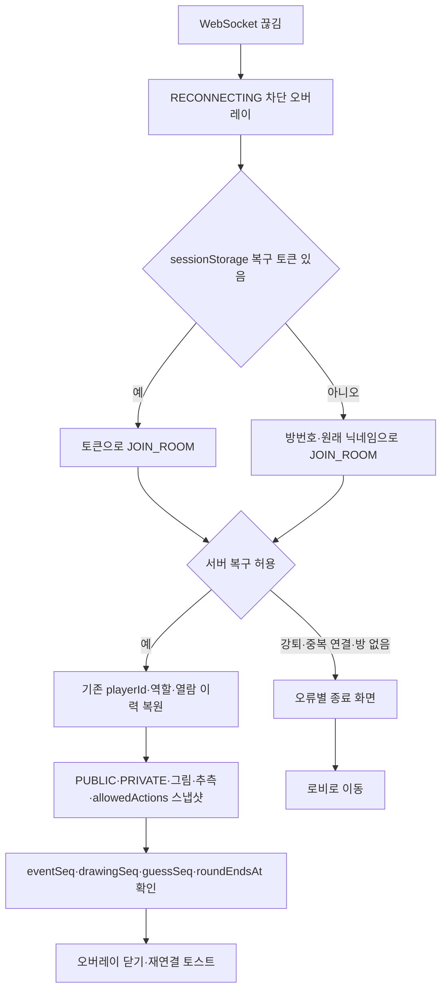

- 다른 닉네임으로 입장하면 기존 슬롯 복구가 아니라 새 플레이어로 처리한다.
- 같은 기기의 다른 탭은 별도 `sessionStorage` 토큰을 사용해 독립 플레이어가 된다.
- drawer로 복귀하면 제시어는 다시 가려진 상태에서 시작한다.

[근거: 게임 설명 13행, 결정 D-14~D-16, 공통 지침 §2.3·§5.4]

## 9. 호스트 연결 끊김과 30분 종료 흐름

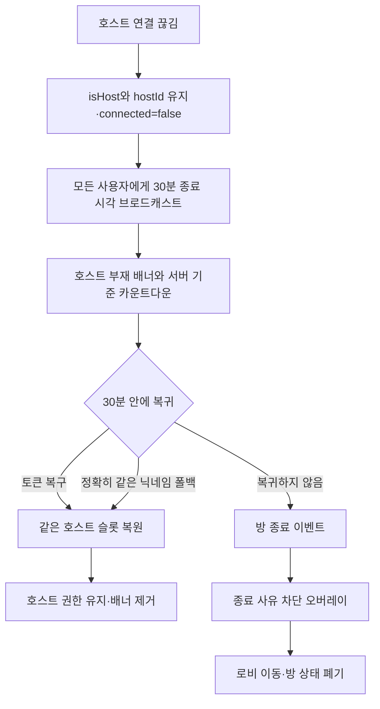

- 호스트 권한은 어떤 사용자에게도 자동 이양하지 않는다.
- 이미 연결된 호스트 닉네임을 다른 연결이 사용하려 하면 거부한다.
- 호스트 부재 중에도 서버가 내려준 `allowedActions`에 포함된 현재 라운드 액션은 계속할 수 있다.

[근거: 게임 설명 14행, 결정 D-16·D-17]

## 10. 강퇴 흐름

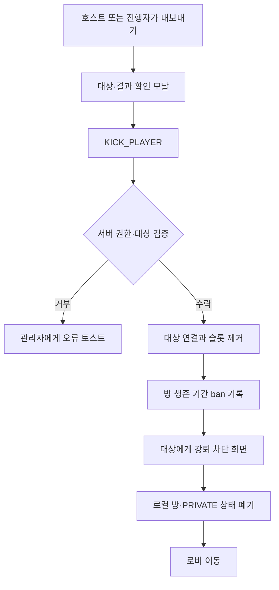

- 같은 복구 토큰과 닉네임의 재입장은 방이 닫힐 때까지 거부한다.
- 새 탭과 새 닉네임 우회까지 계정 없이 완전히 막을 수 없다는 운영 한계를 도움말에 명시한다.

[근거: 게임 설명 13행, 결정 D-14]

## 11. PWA 및 백그라운드 복귀 흐름

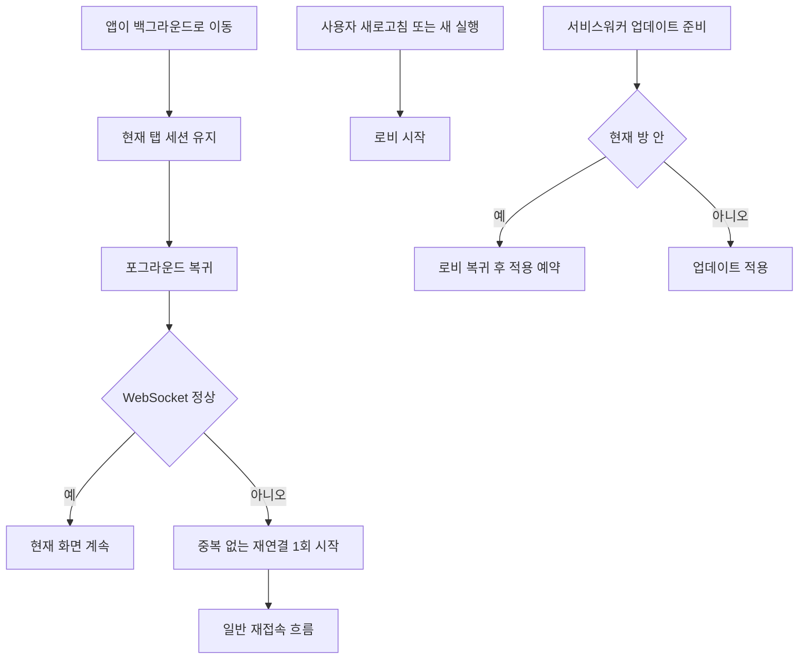

- 앱 셸 캐시가 있어도 서버 연결이 없으면 방 생성·입장·게임 조작을 비활성화한다.
- 서버 재시작 뒤 사라진 방은 복구하지 않고 종료 사유를 표시한다.

[근거: 결정 D-18·D-19, 공통 지침 §4.11·§5.4]
